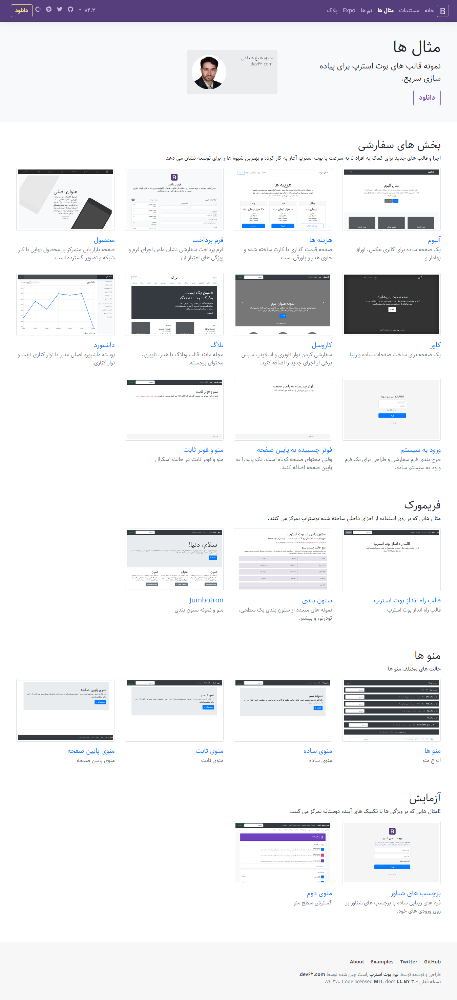

  

<h3 align="center">bootstrap4rtl</h3>

bootstrap 4.3.1 rtl Persian
 
بوت استرپ 4.3.1 راست چین فارسی
 
به همراه تمام نمونه قالب های موجود در سایت اصلی

 

> demo: https://shoae.github.io/bootstrap4rtl/

bootstrap 4.3.1 rtl (Persian)

> RTL version of: https://getbootstrap.com/docs/4.3/examples/

> http://dev62.com

<a class="github-button" target="_blank" href="https://ppng.ir/d/itL4">:gift: حمایت</a>

Donation (WebMoney transfer):

> Wallets: Z762602395329 , X921132827476

Screenshot:

